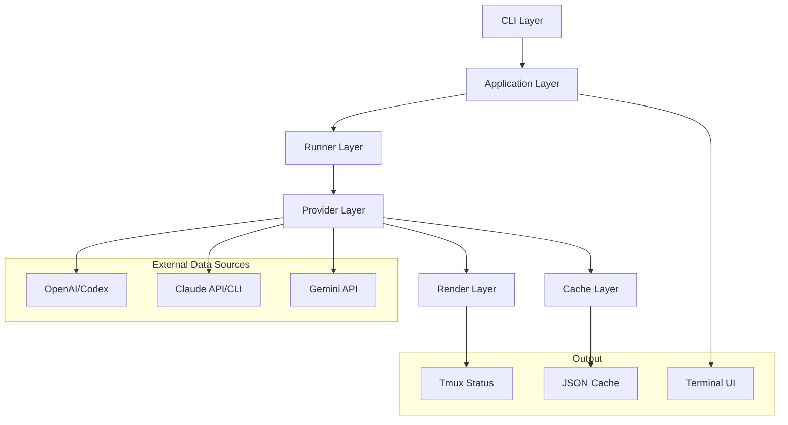

# Architecture Overview

This document provides a comprehensive overview of AI Usage Bar's architecture, design decisions, and system components.

## 🏛️ High-Level Architecture

AI Usage Bar follows a modular, plugin-based architecture with clear separation of concerns:



## 📦 Core Components

### 1. CLI Layer (`cmd/`)

**Purpose**: Entry points for all command-line tools

**Components**:
- `cmd/aubar/`: Main application CLI
- `cmd/quota/`: Claude quota helper binary
- `cmd/gemini-quota/`: Gemini quota helper binary

**Design Principles**:
- Minimal logic - delegate to application layer
- Consistent argument parsing using `cobra`
- Proper signal handling and graceful shutdown

### 2. Application Layer (`internal/app/`)

**Purpose**: Core application orchestration and CLI command implementation

**Key Responsibilities**:
- Configuration loading and validation
- Background process management
- Command routing and execution
- Error handling and user feedback

**Key Types**:
```go
type App struct {
    config   *config.Settings
    runner   *runner.Runner
    cache    *cache.Cache
    providers []provider.Provider
}

type Command interface {
    Execute(ctx context.Context, args []string) error
}
```

### 3. Runner Layer (`internal/runner/`)

**Purpose**: Orchestrates periodic data collection from all providers

**Key Features**:
- Concurrent provider execution with timeout handling
- Intelligent rate limiting and backoff
- Graceful degradation when providers fail
- Configurable refresh intervals

**Core Algorithm**:
```go
func (r *Runner) Collect(ctx context.Context) (*domain.Collection, error) {
    ctx, cancel := context.WithTimeout(ctx, r.globalTimeout)
    defer cancel()
    
    var wg sync.WaitGroup
    snapshots := make(chan domain.ProviderSnapshot, len(r.providers))
    
    for _, p := range r.providers {
        wg.Add(1)
        go func(provider provider.Provider) {
            defer wg.Done()
            
            // Rate limiting check
            if !r.canRefresh(provider) {
                return
            }
            
            // Collect with timeout
            snapshot := provider.FetchUsage(ctx)
            snapshots <- snapshot
        }(p)
    }
    
    go func() {
        wg.Wait()
        close(snapshots)
    }()
    
    // Collect results
    var results []domain.ProviderSnapshot
    for snapshot := range snapshots {
        results = append(results, snapshot)
    }
    
    return &domain.Collection{
        GeneratedAt: time.Now(),
        Snapshots:   results,
    }, nil
}
```

### 4. Provider Layer (`internal/provider/`)

**Purpose**: Abstractions for different AI service data sources

**Design Pattern**: Plugin architecture with common interface

**Core Interface**:
```go
type Provider interface {
    ID() domain.ProviderID
    FetchUsage(ctx context.Context) domain.ProviderSnapshot
    MinInterval() time.Duration
    ValidateConfig(config map[string]interface{}) error
    Close() error
}
```

**Provider Implementations**:

#### OpenAI Provider
- **Data Source**: Local Codex rollout telemetry (`~/.codex/sessions`)
- **Strategy**: File-based parsing with JSONL format
- **Rate Limiting**: 30-second minimum interval
- **Failure Mode**: Graceful degradation when no data available

#### Claude Provider
- **Data Source**: CLI helper (`quota`) with local cache fallback
- **Strategy**: External binary execution with JSON parsing
- **Authentication**: macOS Keychain OAuth token, plus `CLAUDE_CAPTURED_QUOTA_PATH` / `~/.claude/captured_quota.json`
- **Rate Limiting**: 60-second minimum interval

#### Gemini Provider
- **Data Source**: OAuth + API calls
- **Strategy**: Direct HTTP API calls with token refresh
- **Authentication**: `GEMINI_OAUTH_CREDS_PATH` plus runtime `GEMINI_OAUTH_CLIENT_ID` / `GEMINI_OAUTH_CLIENT_SECRET`
- **Rate Limiting**: 60-second minimum interval

### 5. Cache Layer (`internal/cache/`)

**Purpose**: Atomic cache management for persistence

**Design Goals**:
- Atomic writes to prevent corruption
- Multiple format support (text, JSON)
- PID file management for background processes
- Cross-platform path handling

**Key Operations**:
```go
type Cache interface {
    WriteStatus(status string) error
    WriteSnapshot(snapshot *domain.Collection) error
    WritePID(pid int) error
    ReadSnapshot() (*domain.Collection, error)
    ReadStatus() (string, error)
    Clear() error
}
```

### 6. Render Layer (`internal/render/`)

**Purpose**: Converts provider data into display formats

**Supported Formats**:
- Plain text banners
- Tmux color tokens
- JSON structured output
- Terminal UI components

**Rendering Pipeline**:
```go
type Renderer struct {
    theme  *theme.Theme
    config *render.Config
}

func (r *Renderer) RenderBanner(collection *domain.Collection) string {
    // 1. Filter and sort providers
    // 2. Apply theme and formatting
    // 3. Generate output string
    // 4. Add timestamp if needed
}
```

## 🔄 Data Flow

### Collection Flow

1. **Initialization**: CLI loads configuration and initializes providers
2. **Collection**: Runner triggers concurrent provider data collection
3. **Processing**: Results are aggregated into a `Collection`
4. **Caching**: Results are written to cache files atomically
5. **Rendering**: Data is rendered for display (tmux, CLI, etc.)

### Error Handling Flow

1. **Provider Timeout**: Individual provider failures don't affect others
2. **Degraded Mode**: Partial data is still rendered with indicators
3. **Circuit Breaking**: Failed providers are temporarily skipped
4. **User Feedback**: Clear error messages and diagnostic information

## 🏗️ Design Patterns

### 1. Plugin Pattern

**Problem**: Need to support multiple AI providers with minimal core changes

**Solution**: Common `Provider` interface with factory registration

**Benefits**:
- Easy to add new providers
- Isolated provider logic
- Consistent error handling
- Testable components

### 2. Observer Pattern

**Problem**: Multiple components need to react to data changes

**Solution**: Event-driven updates with cache watchers

**Benefits**:
- Loose coupling between components
- Efficient updates
- Extensible notification system

### 3. Strategy Pattern

**Problem**: Different providers need different data collection strategies

**Solution**: Provider-specific implementations of common interface

**Benefits**:
- Flexible data collection methods
- Easy to test individual strategies
- Clear separation of concerns

### 4. Circuit Breaker Pattern

**Problem**: Failed providers should not continuously impact performance

**Solution**: Temporary provider disabling with exponential backoff

**Benefits**:
- System resilience
- Faster recovery
- Better user experience

## 🔧 Configuration Architecture

### Configuration Hierarchy

1. **Default Values**: Built-in defaults in code
2. **Configuration File**: User settings in JSON format
3. **Environment Variables**: Runtime overrides
4. **Command Line Flags**: Per-execution overrides

### Configuration Schema

```go
type Settings struct {
    Version    int              `json:"version"`
    Refresh    RefreshConfig    `json:"refresh"`
    Providers  ProvidersConfig  `json:"providers"`
    Tmux       TmuxConfig       `json:"tmux"`
    Theme      ThemeConfig      `json:"theme"`
}
```

### Provider Configuration

Each provider has:
- **Enabled flag**: Can be disabled without removing configuration
- **Source order**: Priority order for data sources
- **Timeout settings**: Per-provider timeout configuration
- **Rate limiting**: Minimum interval between requests
- **Authentication**: Credential reference and settings

## 🧪 Testing Architecture

### Test Organization

```
tests/
├── unit/           # Unit tests for individual components
├── integration/    # Cross-component tests
├── e2e/           # End-to-end scenario tests
└── fixtures/       # Test data and mocks
```

### Testing Strategies

#### Unit Tests
- Mock external dependencies
- Test individual functions and methods
- Focus on business logic
- Fast execution

#### Integration Tests
- Test component interactions
- Use real configuration
- Test error scenarios
- Medium execution time

#### End-to-End Tests
- Full CLI command testing
- Real provider integration (when possible)
- User workflow validation
- Slower but comprehensive

### Mock Strategy

```go
// Mock provider for testing
type MockProvider struct {
    snapshot domain.ProviderSnapshot
    err      error
    delay    time.Duration
}

func (m *MockProvider) FetchUsage(ctx context.Context) domain.ProviderSnapshot {
    if m.delay > 0 {
        time.Sleep(m.delay)
    }
    return m.snapshot
}
```

## 🔒 Security Architecture

### Credential Management

**Keyring Integration**:
- macOS: System Keychain
- Linux: Keyring/GNOME Keyring
- Fallback: Environment variables

**Security Principles**:
- Never log credentials
- Encrypt sensitive data at rest
- Use secure credential storage
- Implement credential rotation

### Network Security

**HTTPS Only**: All API calls use HTTPS
**Certificate Validation**: Proper TLS certificate verification
**Timeout Protection**: Prevent hanging connections
**Rate Limiting**: Respect provider rate limits

## 📈 Performance Considerations

### Concurrent Design

- **Goroutine Pool**: Limit concurrent provider calls
- **Context Cancellation**: Proper timeout handling
- **Memory Efficiency**: Reuse buffers and minimize allocations
- **CPU Optimization**: Efficient JSON parsing and string operations

### Caching Strategy

- **Multi-level Caching**: In-memory + disk cache
- **Cache Invalidation**: Time-based + event-driven
- **Atomic Operations**: Prevent cache corruption
- **Compression**: Optional cache compression for large datasets

### Resource Management

- **Connection Pooling**: Reuse HTTP connections
- **Memory Limits**: Prevent memory leaks
- **File Handle Management**: Proper file descriptor cleanup
- **Graceful Shutdown**: Clean resource release

## 🚀 Deployment Architecture

### Binary Distribution

- **Static Linking**: No external dependencies at runtime
- **Cross-compilation**: Support multiple architectures
- **Small Footprint**: Optimized binary size
- **Version Management**: Semantic versioning with build info

### Installation Methods

1. **Direct Download**: Pre-compiled binaries
2. **Package Managers**: Homebrew, APT, etc.
3. **Source Build**: Go toolchain
4. **Container**: Docker images

### Configuration Management

- **Default Paths**: Platform-specific standard locations
- **Migration Support**: Automatic configuration upgrades
- **Validation**: Early configuration error detection
- **Backup**: Automatic configuration backup before changes

## 🔮 Future Architecture Considerations

### Scalability

- **Horizontal Scaling**: Multiple Aubar instances
- **Load Balancing**: Distribute provider load
- **Caching Layer**: Redis/memcached support
- **API Server**: REST API for remote monitoring

### Extensibility

- **Web UI**: Browser-based dashboard
- **Metrics**: Prometheus integration
- **Alerting**: Webhook/Slack notifications
- **Plugins**: Dynamic provider loading

### Monitoring

- **Health Checks**: Comprehensive system health
- **Performance Metrics**: Latency and throughput tracking
- **Error Tracking**: Detailed error analytics
- **Usage Analytics**: Anonymous usage statistics

## 📚 Architecture Decisions

### Why Go?

- **Performance**: Compiled language with good concurrency
- **Cross-platform**: Easy deployment across platforms
- **Ecosystem**: Rich standard library and third-party packages
- **Maintainability**: Strong typing and good tooling

### Why Plugin Architecture?

- **Flexibility**: Easy to add new providers
- **Testing**: Isolated provider testing
- **Maintenance**: Minimal core changes for new providers
- **Community**: Easy contributions

### Why Local-first Approach?

- **Privacy**: No data sent to external servers
- **Performance**: Fast local data access
- **Reliability**: Works without internet connectivity
- **Security**: Credentials never leave user's machine

This architecture provides a solid foundation for a reliable, extensible, and maintainable AI usage monitoring tool.
